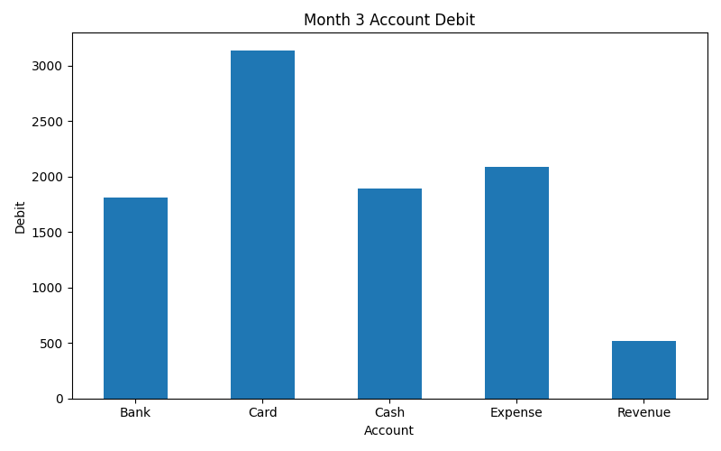

# Accounting Transaction Report

거래 데이터를 분석하여 월별 및 계정별 debit 흐름을 확인하고, 사용자가 입력한 월의 account별 TOP 3와 그래프를 출력하는 Python 프로젝트이며 pandas 학습과 회계 데이터 분석을 결합한 프로젝트입니다.

## Tech Stack
- Python
- pandas
- matplotlib

## Features
- CSV 파일 불러오기
- 날짜 컬럼을 datetime으로 변환
- month 컬럼 생성
- 월별 debit 합계 계산
- 계정별 debit 합계 계산
- pivot_table을 이용한 월별 x 계정별 debit 표 생성
- 사용자가 입력한 월의 account별 TOP 3 출력
- 사용자가 입력한 월의 account별 debit 그래프 저장

## Project Structure
```text
accounting-transaction-report/
├── main.py
├── README.md
├── data/
│   └── transactions.csv
├── result/
│   └── 3_debit.png
└── .gitignore
```

## How to Run
1. `data/transactions.csv` 파일을 준비합니다.
2. 아래 명령어를 실행합니다.

```bash
python3 main.py
```

## Result

### Example Output Graph

아래 그래프는 선택한 달의 Account별 Debit 내역을 보여줍니다.


